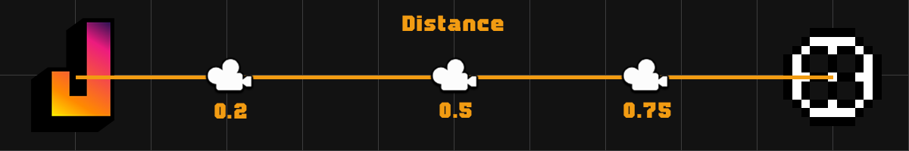
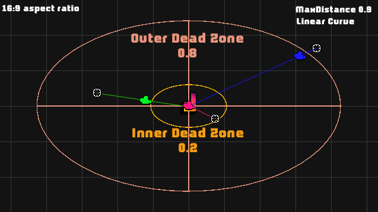

# 2D Aimed Follow Camera Documentation
Makes the camera follow the player and mose, usefull in Top-Down games where you can allow to see more where the player
is trying to look at.
This camera movement was achieved by revers engineering the camera in Enter the Gungeon.

### Usage

- Add the Script AimCameraComponent to your camera.
- In the component parameters add your player.
- Adjust other parameters to your liking.

### How It works

To move the camera, the viewport mouse position is used, meaning it works relative to the screen size.

Suppose we are always drawing a line from the player to the mouse. We will define **distance** as the point on this line where the camera is placed, measured from 0 to 1, where 0 is the player's position and 1 is the mouse's position.

the script defines 3 mouse zones: 
- form player to **InnerZone**: where the **distance** will always be 0, so the camera won't move at all.
- form **InnerZone** to **OuterZone**: where **distance** will be interpolated between 0 and **MaxDistance** using the specified **Curve**.
- from **OuterZone** to the edge of the screen: where the **distance** will always be equal to **MaxDistance**.

because the areas are measured relative to the screen size, they will be bigger on the x-axis than on the y-axis.

### Parameters

* Player: Object the camera will follow
* Curve: Function to use when interpolating the position.
    * Linear: Will increase the distance the same amount at any mouse position.
    * Square: will increase the distance, very little when the mouse is near the inner zone, but way more when the mouse is
      near the outer zone.
    * InvertedSquare: will increase the distance, very a lot when the mouse is near the inner zone, but way less when the mouse is
      near the outer zone.
    * Sine: the distance will increase little near the zone edges but will change faster while in the center of the area.
* Inner Zone: Mouse position at which the camera will start moving away from the character. measured as a
  percentage from the center to an edge of the screen
* Outer Zone: Mouse position at which the camera will stop incrementing the relative distance between the mouse and
  character. measured as a percentage from the center to an edge of the screen
* Max Distance: The maximum distance the camera acn be from the player, measured as a percentage of the distance from the player to the cursor.
* Offset: The camera offset from the player on the z axis.
* Smooth Speed: The time it will take the camera to reach the desired position.
