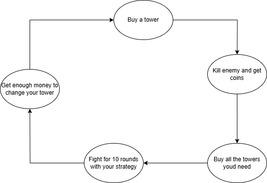
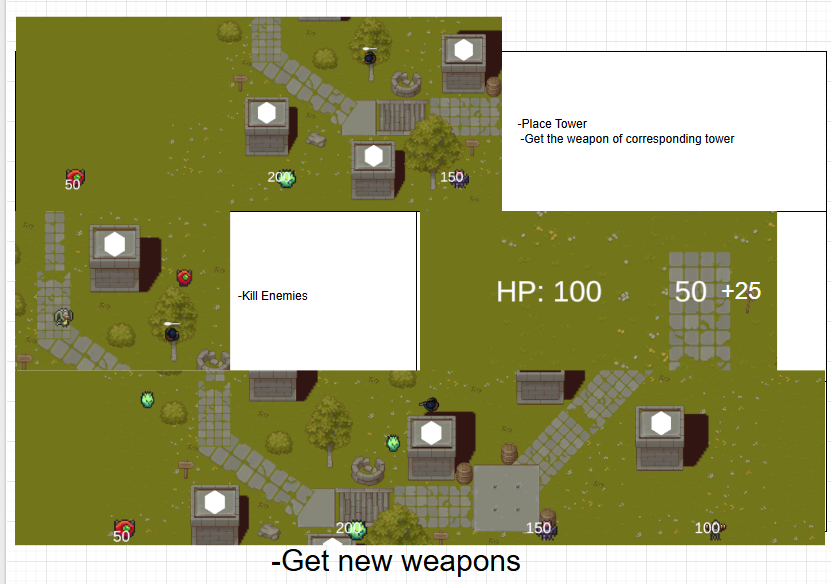

# Sprint 0 - Game Design Document : Tower Defense  
**Naam:** Arthur  
**Klas:** GD1B  
**Datum:** 08/09/2025  

---

## 1. Titel en elevator pitch  
**Titel:** Dragon Defense  

**Elevator pitch (maximaal twee zinnen):**  
My game is a tower defense where the player can build different types of towers. Every 10 waves the towers must be swapped, forcing the player to adapt and adding variety and strategy to the gameplay.  

---

## 2. Wat maakt jouw tower defense uniek  
Most tower defense games let players pick a "meta" and stick with it. In my game, every 10 waves the towers **must** be changed, preventing repetitive strategies and keeping the player engaged with new combinations.  

---

## 3. Schets van je level en UI  
Hier voeg je schetsen of mockups in van je level, UI en HUD.  

  

---

## 4. Torens  
📌 *Alle waarden zijn startwaarden en kunnen later gebalanceerd worden via playtesting.*  

**Basis torens:**  
- **Fast Tower** – Damage: **5**, Fire rate: **0.3s/shot**, Range: **4 units**, Cost: **80**, Upgrade cost: **+50** per level.  
- **Slow Tower** – Damage: **25**, Fire rate: **2s/shot**, Range: **5 units**, Cost: **120**, Upgrade cost: **+70** per level.  
- **Long Range Tower** – Damage: **10**, Fire rate: **1s/shot**, Range: **8 units**, Cost: **100**, Upgrade cost: **+60** per level.  
- **Short Range Tower** – Damage: **40**, Fire rate: **1.5s/shot**, Range: **2.5 units**, Cost: **150**, Upgrade cost: **+75** per level.  
- **Freeze Tower** – Damage: **0**, Effect: slows enemy speed by **40%** for **2s**, Range: **5 units**, Fire rate: **1s**, Cost: **130**, Upgrade cost: **+65** per level.  
- **Flame Tower** – Damage: **3 DPS for 4s** (DoT effect), Initial hit: **5**, Range: **4 units**, Fire rate: **1s**, Cost: **140**, Upgrade cost: **+70** per level.  

**Eventuele extra torens:**  
- TBD (can be added later).  

---

## 5. Vijanden  
**Basis vijanden:**  
- **Normal** – HP: **100**, Speed: **2 units/sec**, Reward: **10**.  
- **Fast** – HP: **50**, Speed: **4 units/sec**, Reward: **8**.  
- **Heavy** – HP: **300**, Speed: **1.2 units/sec**, Reward: **20**, Slow resistance: **50%**.  
- **Support** – HP: **120**, Speed: **2 units/sec**, Reward: **15**, Heals nearby enemies: **10 HP every 3s**.  
- **Invisible** – HP: **90**, Speed: **2.5 units/sec**, Reward: **12**, Requires reveal tower.  

**Boss enemy (every 10 waves):**  
- HP: **2000**, Speed: **1.5 units/sec**, Reward: **100**, Special: immune to Freeze for **5s** after first slow.  

---

## 6. Gameplay loop  
- Player starts with **200 gold** and **20 lives**.  
- Player builds towers.  
- Enemies spawn in waves.  
- Towers attack enemies automatically.  
- Player earns **gold rewards** for kills.  
- Currency is used to place/upgrade towers.  
- Every 10 waves: **mandatory tower swap** (player chooses new loadout).  
- Survive as long as possible.  

  

---

## 7. Progressie  
- Each wave adds **+10% enemy HP** and **+5% speed** compared to previous.  
- Rewards scale at **+10% per wave**.  
- Boss appears at wave milestones (10, 20, 30...).  
- Tower swap forces players to **rethink loadouts every 10 waves**.  

---

## 8. Risico’s en oplossingen volgens PIO  

- **Probleem 1:** Balancing the towers and enemies.  
  - **Impact:** Game might feel too easy or too hard.  
  - **Oplossing:** Playtesting and adjusting stats regularly.  

- **Probleem 2:** Forced tower swaps may frustrate players.  
  - **Impact:** Players feel they have no control.  
  - **Oplossing:** Give a choice of **2–3 towers** each swap so they feel agency.  

- **Probleem 3:** Invisible enemies could be unfair.  
  - **Impact:** Players might feel punished without warning.  
  - **Oplossing:** Introduce tutorials/hints before invisible enemies appear.  

---

## 9. Planning per sprint en mechanics (Trello-sync)

### Sprint 1 — Core loop online
- [ ] Pathing system (waypoints: **5–8 per map**)  
- [ ] WaveManager (interval: **1s between spawns**)  
- [ ] Placeable spots (grid: **5x5**, ~25 spots)  
- [ ] Basic Tower (range: **3 units**, fire rate: **1s**)  
- [ ] Projectile system (speed: **6 units/sec**)  
- [ ] Collision & damage (apply **10 damage**)  
- [ ] UI basic (money + lives)  

### Sprint 2 — First playable
- [ ] Normal enemy (HP: **100**, Speed: **2**)  
- [ ] Targeting system (closest/first-in-path toggle)  
- [ ] HP system (enemy health bar above enemy)  
- [ ] Enemy death & reward (**+10 gold**)  
- [ ] Goal/life loss (**-1 life per escaped enemy**)  
- [ ] Build/sell flow (refund: **70% of cost**)  

### Sprint 3 — Variety & economy
- [ ] Economy system (starting gold: **200**, wave income: **+50 per wave**)  
- [ ] Light enemy (HP: **50**, Speed: **4**, Reward: **20**)  
- [ ] Heavy enemy (HP: **300**, Speed: **1.2**, Reward: **2250**)  
- [ ] Invisible enemy (HP: **90**, Speed: **2.5**, Reward: **12**)  
- [ ] Support enemy (HP: **120**, heal: **10 HP every 3s**)  
- [ ] Low-range tower (damage: **40**, range: **2.5**)  
- [ ] Tower upgrades (+20% stats per level)  

### Sprint 4 — Unique feature & depth
- [ ] Tower swap mechanic (mandatory swap every **10 waves**)  
- [ ] Freeze tower (slow: **40% for 2s**)  
- [ ] Flame tower (DoT: **3 DPS for 4s**)  
- [ ] Reveal mechanic (range: **5 units**, cost: **100**)  
- [ ] UI upgrade menu (upgrade cost scaling: **+50% each level**)  
- [ ] Enemy resistances (Heavy: **slow resist 50%**, Boss: **temporary immunity**)  

### Sprint 5 — Boss & polish
- [ ] Boss enemy (HP: **2000**, reward: **100**)  
- [ ] Sound effects (shoot, music, hits)  

---

## 10. Inspiratie  
De game **Bloons Tower Defense (BTD6)** inspireert mij, vooral hoe de game veel verschillende torens en strategieën aanbiedt.  
Wat ik meeneem: variatie in torens en vijanden, duidelijke progressie en feedback.  
Wat ik vermijd: te veel grind of repetitieve strategieën — mijn unieke feature dwingt juist tot afwisseling.  

---

## 11. Technisch ontwerp mini  

### 11.1 Vijandbeweging over het pad  
- **Keuze:** Vijanden volgen een reeks waypoints tot aan de goal.  
- **Risico:** Vijanden lopen een waypoint voorbij of blijven hangen.  
- **Oplossing:** Check afstand tot waypoint; als dichtbij genoeg → ga naar de volgende. Bij goal: verwijder vijand en verlaag levens met 1.  
- **Acceptatie:** 10 vijanden bewegen van start naar goal zonder vast te lopen en verbruiken elk één leven.  

### 11.2 Doel kiezen en schieten  
- **Keuze:** Torens zoeken automatisch het dichtstbijzijnde vijand binnen hun bereik en schieten projectielen.  
- **Risico:** Torens kiezen geen doel of blijven op een dood vijand schieten.  
- **Oplossing:** Regelmatige check op actieve vijanden in range en switch target als nodig.  
- **Acceptatie:** Elke toren valt altijd een geldig vijand aan zolang die in range is.  

### 11.3 Waves en spawnen  
- **Keuze:** Vijanden spawnen in golven met een korte interval per vijand. Elke wave wordt moeilijker.  
- **Risico:** Te veel vijanden tegelijk → lag of onbalans.  
- **Oplossing:** Max aantal vijanden per wave en wachttijd tussen spawns instellen.  
- **Acceptatie:** Elke wave spawnt vijanden met toenemende moeilijkheid zonder technische problemen.  

### 11.4 Economie en levens  
- **Keuze:** Speler krijgt geld door vijanden te verslaan. Elke vijand bij de goal kost 1 leven.  
- **Risico:** Te weinig of te veel geld → slechte balans.  
- **Oplossing:** Geldwaarden en kosten instelbaar via variabelen zodat balans snel kan worden aangepast.  
- **Acceptatie:** Speler kan torens plaatsen/upgraden met verdiend geld en verliest levens als vijanden de goal bereiken.  

### 11.5 UI basis  
- **Keuze:** Simpele UI met geld, levens en wave-informatie.  
- **Risico:** UI is onduidelijk of past niet goed bij schermresolutie.  
- **Oplossing:** UI bouwen met canvas en anchors zodat het schaalt op verschillende schermen.  
- **Acceptatie:** Speler ziet altijd zijn geld, levens en huidige wave duidelijk in beeld.  

---

## 12. Trello  
[Trello Board](https://trello.com/invite/b/68be86f11b0fd1599436af44/ATTI4fae26223c69d7fe3d588c43749edded7E21C96A/towerdefense)  


## 13. Game Design Document
  

## 14. Video

Watch the gameplay video on YouTube:  
[Dragon Defense Gameplay](https://www.youtube.com/watch?v=xlR9lBvwiQA)


## 15. Dependencies

# Player Dependencies

PlayerAttackController  >  PlayerWeaponController  (read State: WeaponType)  
PlayerAttackController  >  PlayerProjShooter  (call Function: ShootProjectile)  
PlayerAttackController  >  PlayerSound  (trigger Event: OnShot)  
PlayerAttackController  >  DoTweenPlayerAnimation  (trigger Event: OnShot)  
PlayerAttackController  >  PlayerAmmoUI  (trigger Event: OnAmmoChanged)  

PlayerWeaponController  >  TowerAttackController  (read State: TowerType)  
PlayerWeaponController  >  SpriteRenderer  (write Property: sprite)  

PlayerProjShooter  >  Rigidbody2D  (write Velocity Vector2)  

Move  >  Rigidbody2D  (write Velocity Vector2)  
PlayerDirectionFollowMouse  >  Camera.main  (read Method: ScreenToWorldPoint)  

PlayerHealth  >  SceneManager  (call Function: ReloadScene / DestroyOnDeath)  
PauseSystem  >  Time.timeScale  (read/write Float)


# Tower Dependencies

TowerAttackController  >  RotatingMovement  (call Functions: SetOrbitPosition, UpdateRadius)  
TowerAttackController  >  ProjectileShooter  (call Function: FireProjectile)  
TowerAttackController  >  TowerType  (read Enum: TowerType)  

ProjectileShooter  >  Rigidbody2D  (write Velocity Vector2)  
ProjectileShooter  >  EnemyFinder  (call Function: GetNearestTarget)  

TowerProjectile  >  EnemyHealth  (call Function: TakeDamage(Float))  

SellTower  >  TowerSpot  (call Function: RemoveTower)  
SellTower  >  CurrencyManager  (call Function: AddCurrency(Int))  

TowerPlacementManager  >  TowerSpot  (read/write Function: FindValidSpot, AssignTower)  
TowerPlacementManager  >  TowerFactory  (call Function: FinalizePlacement)  
TowerPlacementManager  >  CurrencyManager  (call Function: SpendCurrency(Int))  

TowerDragHandler  >  TowerFactory  (call Function: CreatePreview)  
TowerDragHandler  >  TowerPlacementManager  (call Functions: ValidateSpot, PlaceTower)  

TowerFactory  >  TowerPreview  (write Visual State)  
TowerFactory  >  Collider2D + MonoBehaviour  (toggle Enabled State)  

TowerPreview  >  LineRenderer  (draw Circle / write Points Array)  
TowerSpot  >  SellTower  (assign Reference)


# UI & Managers

CurrencyManager > Currency UI (read/write TextMeshProUGUI / Text Value Int)

HealthManager > PlayerHealth (read Float: CurrentHealth)

ReloadBarUI > PlayerAttackController (subscribe Event: OnReload, read Float: ReloadTime)

UiWave > WaveChecker (read Int: WaveNumber, subscribe Events)


# Scene & Music Systems

RespawnableToggle > SceneToggleManager (register/unregister Functions, read Scene State)

SceneToggleManager > RespawnableToggle (call Function: HandleSceneChange)

MusicManager > WaveChecker / EnemyEvents (subscribe Events, read AudioClip References)

NextSceneButton > SceneManager (call Function: LoadNextScene)

ReloadAllScenes > SceneManager (call Functions: UnloadSceneAsync, LoadSceneAsync)


# Enemy & Wave System

EnemyPath > EndPointDamage / EnemyHealth / EnemyScaler (trigger Events, read/write Float: Speed)

EnemyEvents > EnemyHealth / EnemyReward / WaveChecker / WaveDifficultyManager (invoke Events, read/write States)

EnemyHealth > EnemyHealthBar / EnemyEvents (read/write Float: CurrentHealth, trigger Events)

EnemyReward > CurrencyManager (call Function: AddCurrency(Int))

EnemyScaler > EnemyHealth / EnemyPath / WaveDifficultyManager (read/write Float: ScaleFactor, Speed, Health)

EnemySpawner > PathBuilder / WaveChecker / WaveDifficultyManager (call Functions: SpawnWave, GetWaveData)

WaveChecker > EnemySpawner / EnemyEvents / CurrencyManager (read/write Int: WaveNumber, subscribe Events)

WaveDifficultyManager > EnemySpawner / EnemyScaler / EnemyEvents / WaveChecker (read/write Float: DifficultyMultiplier)

HealArea > EnemyHealth (read/write Float: HealAmount)

EnemyHealer > HealArea (call Function: HealNearby)

EndPointDamage > PlayerHealth / EnemyPath / EnemyEvents (call Function: TakeDamage, trigger Event: OnReachedEnd)

PathBuilder > EnemyPath (call Function: SetPath)


---

## 15.Class Diagrams
# 🧩 Class Diagrams

This document contains class diagrams (in Mermaid format) for all systems in the project.

```mermaid
classDiagram
    class PlayerAttackController {
        - weaponController : PlayerWeaponController
        - projShooter : PlayerProjShooter
        - playerSound : PlayerSound
        - playerAnim : DoTweenPlayerAnimation
        - ammoUI : PlayerAmmoUI
        + OnShot : Event
        + OnAmmoChanged : Event
        + Shoot()
        + Reload()
    }

    class PlayerWeaponController {
        - towerAttack : TowerAttackController
        - spriteRenderer : SpriteRenderer
        + WeaponType : Enum
        + SwitchWeapon()
    }

    class PlayerProjShooter {
        - rb : Rigidbody2D
        + ShootProjectile()
    }

    class Move {
        - rb : Rigidbody2D
        + MovePlayer()
    }

    class PlayerDirectionFollowMouse {
        - cam : Camera
        + UpdateRotation()
    }

    class PlayerHealth {
        + CurrentHealth : float
        + TakeDamage(amount : float)
        - Die()
    }

    class PauseSystem {
        - isPaused : bool
        - pauseMenuUI : GameObject
        + PauseGame()
        + ResumeGame()
    }
classDiagram
    class TowerAttackController {
        - rotator : RotatingMovement
        - shooter : ProjectileShooter
        + towerType : Enum
        + AttackTarget()
    }

    class ProjectileShooter {
        - rb : Rigidbody2D
        - finder : EnemyFinder
        + FireProjectile()
    }

    class TowerProjectile {
        - damage : float
        + OnCollisionEnter2D(collision : Collision2D)
    }

    class SellTower {
        - towerSpot : TowerSpot
        - currencyManager : CurrencyManager
        + Sell()
    }

    class TowerPlacementManager {
        - towerSpot : TowerSpot
        - towerFactory : TowerFactory
        - currencyManager : CurrencyManager
        + TryPlaceTower()
    }

    class TowerDragHandler {
        - towerFactory : TowerFactory
        - towerPlacementManager : TowerPlacementManager
        + StartDrag()
        + DropTower()
    }

    class TowerFactory {
        - preview : TowerPreview
        - colliders : Collider2D[]
        + CreateTower()
    }

    class TowerPreview {
        - lineRenderer : LineRenderer
        + DrawRange(radius : float)
    }

    class TowerSpot {
        - sellTower : SellTower
        + AssignSpot()
    }
classDiagram
    class CurrencyManager {
        + static Instance : CurrencyManager
        - startingCurrency : int
        - currentCurrency : int
        - currencyTextTMP : TextMeshProUGUI
        - currencyText : Text
        + AddCurrency(amount : int)
        + SpendCurrency(amount : int) : bool
        + SetCurrency(amount : int)
    }

    class HealthManager {
        - playerHealth : PlayerHealth
        - textMeshPro : TextMeshProUGUI
        + Update()
    }

    class ReloadBarUI {
        - reloadSlider : Slider
        - player : Transform
        - offset : Vector3
        + StartReload(reloadTime : float)
    }

    class UiWave {
        - waveChecker : WaveChecker
        - textMeshPro : TextMeshProUGUI
        + ShowWaveText(wave : int)
    }
classDiagram
    class RespawnableToggle {
        - originalPosition : Vector3
        - originalRotation : Quaternion
        - originalScale : Vector3
        + HandleSceneChange(enable : bool)
    }

    class SceneToggleManager {
        + static Instance : SceneToggleManager
        - registered : List<RespawnableToggle>
        + Register(toggle : RespawnableToggle)
        + Unregister(toggle : RespawnableToggle)
    }

    class MusicManager {
        - normalMusic : AudioClip
        - bossMusic : AudioClip
        - normalSource : AudioSource
        - bossSource : AudioSource
        + PlayNormalMusic()
        + PlayBossMusic()
    }

    class NextSceneButton {
        - nextButton : Button
        + LoadNextScene()
    }

    class ReloadAllScenes {
        + ReloadAll() : IEnumerator
    }
classDiagram
    class EnemyPath {
        + speed : float
        + Move()
        + OnReachedEnd : Event
    }

    class EnemyEvents {
        + OnBossDefeated : Event
        + OnEnemyKilled : Event
    }

    class EnemyHealth {
        + CurrentHealth : float
        + TakeDamage(amount : float)
        - Die()
    }

    class EnemyReward {
        - currencyManager : CurrencyManager
        + GiveReward()
    }

    class EnemyScaler {
        + ScaleStats(multiplier : float)
    }

    class EnemySpawner {
        + SpawnWave()
    }

    class WaveChecker {
        + WaveNumber : int
        + OnBossWave : Event
    }

    class WaveDifficultyManager {
        + DifficultyMultiplier : float
    }

    class HealArea {
        + HealEnemies()
    }

    class EnemyHealer {
        - healArea : HealArea
        + HealNearby()
    }

    class EndPointDamage {
        + DamagePlayer()
    }

    class PathBuilder {
        + BuildPath()
    }
```


